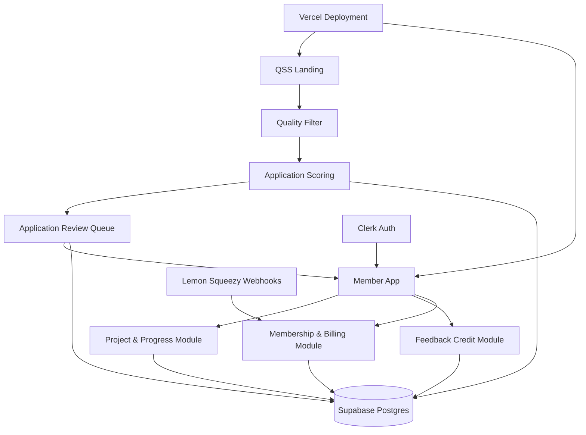

# Component Diagram

```mermaid
graph TD
  A["QSS Landing"] --> B["Quality Filter"]
  B --> C["Application Scoring"]
  C --> D["Application Review Queue"]
  D --> E["Member App"]
  E --> F["Project & Progress Module"]
  E --> G["Feedback Credit Module"]
  E --> H["Membership & Billing Module"]
  I["Clerk Auth"] --> E
  F --> J[("Supabase Postgres")]
  G --> J
  C --> J
  D --> J
  H --> J
  K["Lemon Squeezy Webhooks"] --> H
  L["Vercel Deployment"] --> A
  L --> E
```
