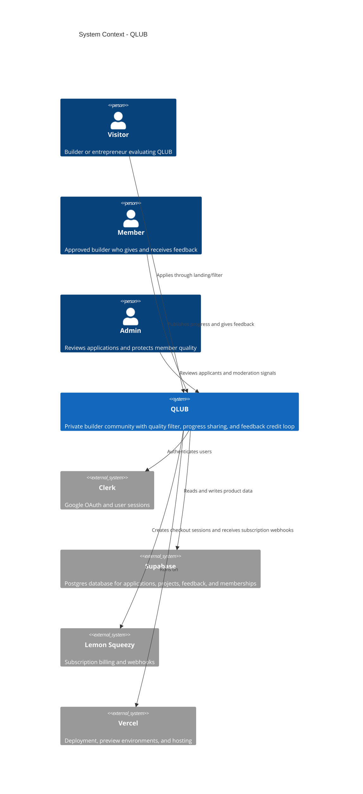

# System Context Diagram

```mermaid
C4Context
  title System Context - QLUB
  Person(visitor, "Visitor", "Builder or entrepreneur evaluating QLUB")
  Person(member, "Member", "Approved builder who gives and receives feedback")
  Person(admin, "Admin", "Reviews applications and protects member quality")
  System(qlub, "QLUB", "Private builder community with quality filter, progress sharing, and feedback credit loop")
  System_Ext(clerk, "Clerk", "Google OAuth and user sessions")
  System_Ext(supabase, "Supabase", "Postgres database for applications, projects, feedback, and memberships")
  System_Ext(lemon, "Lemon Squeezy", "Subscription billing and webhooks")
  System_Ext(vercel, "Vercel", "Deployment, preview environments, and hosting")
  Rel(visitor, qlub, "Applies through landing/filter")
  Rel(member, qlub, "Publishes progress and gives feedback")
  Rel(admin, qlub, "Reviews applicants and moderation signals")
  Rel(qlub, clerk, "Authenticates users")
  Rel(qlub, supabase, "Reads and writes product data")
  Rel(qlub, lemon, "Creates checkout sessions and receives subscription webhooks")
  Rel(qlub, vercel, "Runs on")
```
