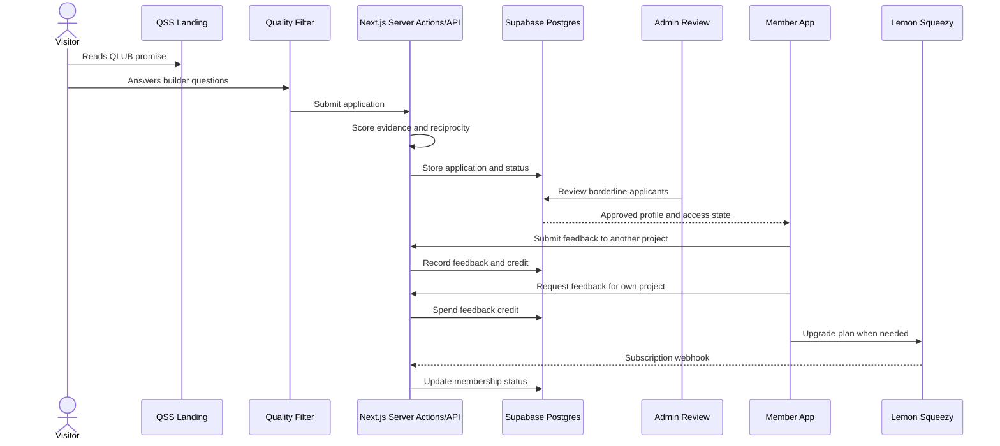

# Data Flow - Application And Feedback Loop

```mermaid
sequenceDiagram
  actor Visitor
  participant Landing as QSS Landing
  participant Filter as Quality Filter
  participant API as Next.js Server Actions/API
  participant DB as Supabase Postgres
  participant Admin as Admin Review
  participant Member as Member App
  participant Billing as Lemon Squeezy

  Visitor->>Landing: Reads QLUB promise
  Visitor->>Filter: Answers builder questions
  Filter->>API: Submit application
  API->>API: Score evidence and reciprocity
  API->>DB: Store application and status
  Admin->>DB: Review borderline applicants
  DB-->>Member: Approved profile and access state
  Member->>API: Submit feedback to another project
  API->>DB: Record feedback and credit
  Member->>API: Request feedback for own project
  API->>DB: Spend feedback credit
  Member->>Billing: Upgrade plan when needed
  Billing-->>API: Subscription webhook
  API->>DB: Update membership status
```
